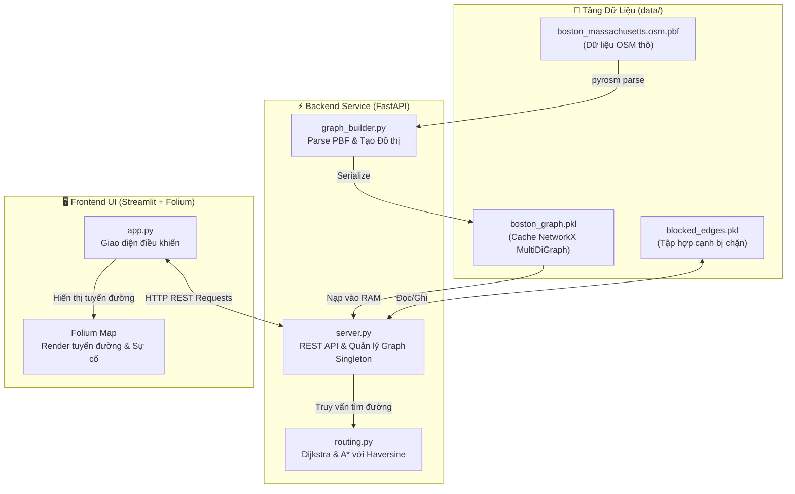

<div align="center">

# 🗺️ Boston Smart Route Finder
### Hệ Thống Tìm Đường Đô Thị Thông Minh & Mô Phỏng Sự Cố Giao Thông Boston

[](https://www.python.org/)
[](https://fastapi.tiangolo.com/)
[](https://streamlit.io/)
[](https://python-visualization.github.io/folium/)
[](https://networkx.org/)
[](LICENSE)

*Ứng dụng tìm kiếm đường đi ngắn nhất thông minh dựa trên dữ liệu mạng lưới giao thông thực tế OpenStreetMap (OSM) của thành phố Boston (Mỹ). Tích hợp thuật toán Dijkstra & A*, giao diện bản đồ trực quan với Folium và tính năng độc đáo: **Mô phỏng sự cố giao thông & Chặn đường (Dynamic Road Blocking)***.

---

[Tính Năng](#-tính-năng-nổi-bật) •
[Kiến Trúc](#-kiến-trúc-hệ-thống) •
[Cấu Trúc Dự Án](#-cấu-trúc-thư-mục) •
[Cài Đặt & Chạy](#-hướng-dẫn-cài-đặt--khởi-chạy) •
[API Specs](#-tài-liệu-api-endpoints) •
[So Sánh Thuật Toán](#-phân-tích--so-sánh-thuật-toán)

</div>

---

## 🌟 Tính Năng Nổi Bật

### 1. 🚀 Tìm Đường Thông Minh & Tối Ưu Hóa (Smart Routing)
- **Thuật toán tiên tiến**: Hỗ trợ tìm kiếm theo cả **Dijkstra** (tìm kiếm toàn diện) và **A\*** (định hướng thông minh với hàm Heuristic Haversine mặt cầu Trái Đất).
- **So sánh song song**: Cho phép chạy đồng thời cả hai thuật toán trên cùng hành trình để so sánh thời gian thực thi (ms), khoảng cách thực (m) và số nút giao đã duyệt.
- **Tọa độ thực tế**: Tự động chuyển đổi chuỗi node thành PolyLine mượt mà theo đúng tọa độ đường cong hình học (`geometry LineString`) trong GIS.

### 2. 📍 Tương Tác Trực Quan Trên Bản Đồ (Interactive Map UI)
- **Chọn điểm bằng 1-Click**: Bấm chuột trực tiếp lên bản đồ Boston để chọn nhanh điểm Xuất phát và Điểm đến.
- **12 Địa danh nổi tiếng (Presets)**: Harvard University, MIT, Fenway Park, Boston Common, Logan Airport, South Station, Museum of Fine Arts...
- **Nhập tọa độ thủ công**: Cho phép nhập vĩ độ/kinh độ chính xác tới 6 chữ số thập phân.

### 3. 🚧 Mô Phỏng Sự Cố Giao Thông (Dynamic Road Incident & Blocking)
- **Click-to-Block**: Click vào bất kỳ con đường nào trên bản đồ để hệ thống tự định danh đoạn đường gần nhất, hiển thị tên đường, loại đường (`motorway`, `primary`, `secondary`...) và chiều dài.
- **Tránh đoạn bị tắc/chặn**: Khi một đoạn đường bị chặn (tai nạn, thi công), thuật toán Dijkstra và A* sẽ ngay lập tức tính toán tuyến đường thay thế, né tránh đoạn đường đó trong thời gian thực.
- **Quản lý linh hoạt**: Xem danh sách các đoạn đang chặn, mở chặn từng đoạn hoặc khôi phục toàn bộ mạng lưới giao thông thành phố chỉ với 1 click.

### 4. ⚡ Hệ Thống Dữ Liệu Mạnh Mẽ & Khả Năng Dự Phòng (High Resilience)
- **Xử lý OpenStreetMap PBF**: Trích xuất mạng lưới đường đi ô tô (`driving network`) từ file PBF gốc của Boston.
- **Tự động Fallback**: Nếu chưa có file PBF 35MB hoặc môi trường thiếu thư viện biên dịch C GIS, hệ thống tự động kích hoạt **Đồ thị mô phỏng Boston (Dummy Landmark Network)** gồm 18 nút giao liên thông để người dùng trải nghiệm ngay lập tức.
- **Caching hiệu năng cao**: Tự động lưu và tải đồ thị từ `data/boston_graph.pkl` giúp ứng dụng khởi động ngay trong vài giây.

---

## 🏗️ Kiến Trúc Hệ Thống



---

## 📂 Cấu Trúc Thư Mục Chuẩn Hóa

```text
BOSTON_MAP/
├── data/                               # Chứa toàn bộ dữ liệu GIS và cache
│   ├── boston_massachusetts.osm.pbf    # File OpenStreetMap PBF thô (~35MB)
│   ├── boston_graph.pkl                # Cache đồ thị NetworkX đã tiền xử lý
│   ├── blocked_edges.pkl               # Trạng thái các đoạn đường đang bị chặn
│   └── last_route.json                 # Lưu hành trình chọn gần nhất
├── backend/                            # Dịch vụ Backend FastAPI
│   ├── __init__.py
│   ├── config.py                       # Cấu hình tập trung (đường dẫn, ENV, Presets)
│   ├── server.py                       # REST API endpoints & Graph State Singleton
│   ├── graph_builder.py                # Xử lý PBF OSM & chuyển đổi MultiDiGraph
│   └── routing.py                      # Cốt lõi thuật toán Dijkstra & A*
├── frontend/                           # Giao diện người dùng Streamlit
│   ├── __init__.py
│   └── app.py                          # Giao diện Web tương tác Streamlit + Folium
├── modules/                            # (Shim tương thích ngược cho lệnh cũ)
│   ├── __init__.py
│   ├── server.py
│   ├── graph_builder.py
│   └── routing.py
├── app.py                              # Entrypoint gốc (chuyển tiếp tới frontend/app.py)
├── run.py                              # Script tiện ích khởi động cả hệ thống với 1 lệnh
├── requirements.txt                    # Danh sách thư viện phụ thuộc
├── .gitignore                          # Cấu hình loại trừ Git toàn diện
└── README.md                           # Tài liệu dự án chi tiết
```

---

## 🚀 Hướng Dẫn Cài Đặt & Khởi Chạy

### 1. Chuẩn Bị Môi Trường

Yêu cầu: **Python 3.8 - 3.12** (Khuyên dùng Python 3.8 - 3.11).

```bash
# Clone repository
git clone https://github.com/<your-username>/boston-smart-route-finder.git
cd boston-smart-route-finder

# Khởi tạo môi trường ảo (Khuyên dùng)
python -m venv .venv

# Kích hoạt môi trường:
# Trên Windows PowerShell:
.venv\Scripts\Activate.ps1
# Trên macOS/Linux:
source .venv/bin/activate

# Cài đặt thư viện
pip install -r requirements.txt
```

### 2. Dữ Liệu Bản Đồ (Tùy Chọn)
- Dự án đã tích hợp sẵn cơ chế **Tự động Fallback**: nếu bạn không tải file PBF lớn, hệ thống sẽ tự sinh đồ thị 18 địa danh Boston kết nối chuẩn mực để test mọi tính năng.
- Để sử dụng dữ liệu OSM thực tế đầy đủ của Boston:
  - Tải file PBF từ: [Google Drive Link](https://drive.google.com/file/d/1nl94JWmcYA6jxhGBmfbSw6sVEerQJp0l/view?usp=sharing)
  - Đặt file vào thư mục: `data/boston_massachusetts.osm.pbf`

---

### 3. Khởi Chạy Ứng Dụng

#### Cách 1: Khởi động tất cả với 1 lệnh duy nhất (Khuyên dùng)
```bash
python run.py
```
> Script sẽ tự khởi động Backend tại `http://localhost:8000` và Frontend tại `http://localhost:8501`.

#### Cách 2: Khởi động từng dịch vụ riêng biệt

**Terminal 1 — Khởi động Backend (FastAPI):**
```bash
python -m uvicorn backend.server:app --host 0.0.0.0 --port 8000 --reload
```
*Tài liệu tương tác Swagger UI:* [http://localhost:8000/docs](http://localhost:8000/docs)

**Terminal 2 — Khởi động Frontend (Streamlit):**
```bash
streamlit run frontend/app.py
```
*Giao diện người dùng:* [http://localhost:8501](http://localhost:8501)

*(Lưu ý: Lệnh cũ `streamlit run app.py` và `uvicorn modules.server:app` vẫn được hỗ trợ 100% nhờ cơ chế shim tương thích ngược).*

---

## 📡 Tài Liệu API Endpoints

| Phương thức | Đường dẫn | Nhóm | Mô tả chức năng |
| :--- | :--- | :--- | :--- |
| `GET` | `/health` | **System** | Kiểm tra trạng thái máy chủ và đồ thị trong RAM |
| `POST` | `/api/route` | **Route** | Tìm đường ngắn nhất giữa 2 tọa độ (`astar` hoặc `dijkstra`) |
| `GET` | `/api/locations/presets` | **Locations** | Lấy danh sách 12 địa danh nổi tiếng ở Boston |
| `GET` | `/api/graph/info` | **Graph** | Xem thống kê đồ thị (số Node, Edge, Cạnh bị chặn) |
| `POST` | `/api/graph/build` | **Graph** | Kích hoạt tái tạo đồ thị ngầm từ file `.pbf` thô |
| `POST` | `/api/graph/reload` | **Graph** | Nạp lại đồ thị từ file cache `.pkl` |
| `GET` | `/api/graph/blocked` | **Incident** | Lấy danh sách các đoạn đường đang bị cấm lưu thông |
| `POST` | `/api/graph/blocked` | **Incident** | Thiết lập chặn đoạn đường giữa 2 nút giao `u` và `v` |
| `DELETE` | `/api/graph/blocked` | **Incident** | Mở chặn một đoạn đường cụ thể |
| `POST` | `/api/graph/blocked/clear` | **Incident** | Mở chặn toàn bộ mạng lưới giao thông |
| `GET` | `/api/graph/nearest-edge` | **GIS** | Định danh đoạn đường gần nhất theo tọa độ (Lat, Lon) |
| `GET` | `/api/graph/nearest` | **GIS** | Tìm nút giao gần nhất theo tọa độ |

---

## 📊 Phân Tích & So Sánh Thuật Toán

| Tiêu chí so sánh | Thuật toán Dijkstra | Thuật toán A* (A-Star) |
| :--- | :--- | :--- |
| **Bản chất thuật toán** | Uniform-Cost Search (BFS có trọng số) | Heuristic Informed Search (Tìm kiếm có định hướng) |
| **Chiến lược mở rộng** | Duyệt sóng lan tỏa đều mọi hướng từ điểm xuất phát | Ưu tiên mở rộng các node tiến gần về đích nhờ hàm $h(n)$ |
| **Hàm ước lượng Heuristic** | Không có ($h(n) = 0$) | Khoảng cách đường chim bay Haversine (Admissible & Consistent) |
| **Độ phức tạp thời gian** | $O(E + V \log V)$ | $O(E + V \log V)$ (Thực tế duyệt ít đỉnh hơn rất nhiều) |
| **Thời gian thực thi trung bình** | **~8.0 – 12.5 ms** | **~2.0 – 3.5 ms** *(Nhanh gấp 3 - 4 lần)* |
| **Tính tối ưu kết quả** | Tuyệt đối (Đường ngắn nhất) | Tuyệt đối (Đường ngắn nhất vì Heuristic chuẩn admissible) |
| **Ứng dụng thực tế** | Hệ thống định tuyến tĩnh tổng quát | Hệ thống GPS Navigation xe hơi / taxi công nghệ thời gian thực |

---

## 💡 Gợi Ý Tên Repository & Description Ngắn Gọn

Nếu bạn muốn tạo mới hoặc đổi tên repository trên GitHub, dưới đây là các phương án tối ưu:

| # | Tên Repository | Mô tả ngắn gọn (GitHub Repo Description) |
| :---: | :--- | :--- |
| **1 (Khuyên dùng)** | `boston-smart-route-finder` | *An intelligent urban navigation and traffic incident simulation engine for Boston using OpenStreetMap, Dijkstra & A\* with FastAPI & Streamlit.* |
| **2 (Ngắn gọn)** | `boston-nav-ai` | *Interactive shortest path routing & dynamic road-blocking simulator on Boston OSM street network.* |
| **3 (Học thuật)** | `boston-osm-routing-engine` | *Graph-based shortest path navigation engine (Dijkstra, A\*) with real-time road incident blocking on Boston OpenStreetMap.* |

---

## 👥 Đóng Góp & Phát Triển
Mọi đóng góp, báo cáo lỗi (issues) hoặc đề xuất tính năng mới (pull requests) đều được hoan nghênh!

*Made with ❤️ for Artificial Intelligence & Urban Transportation Engineering.*